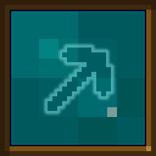
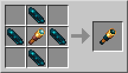
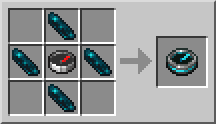
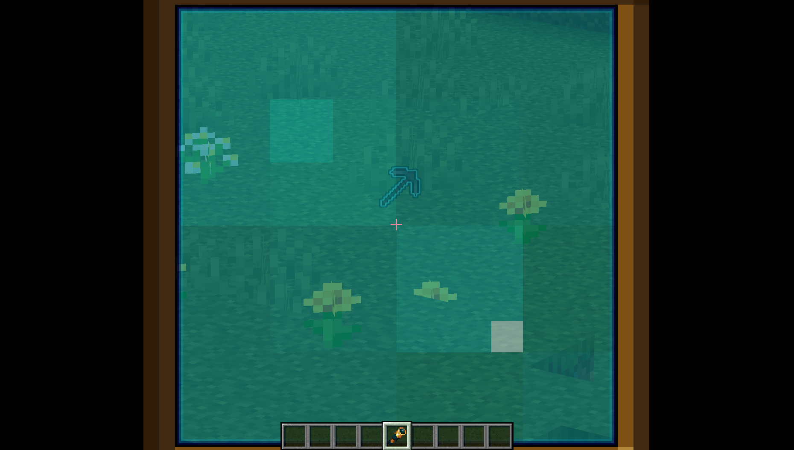
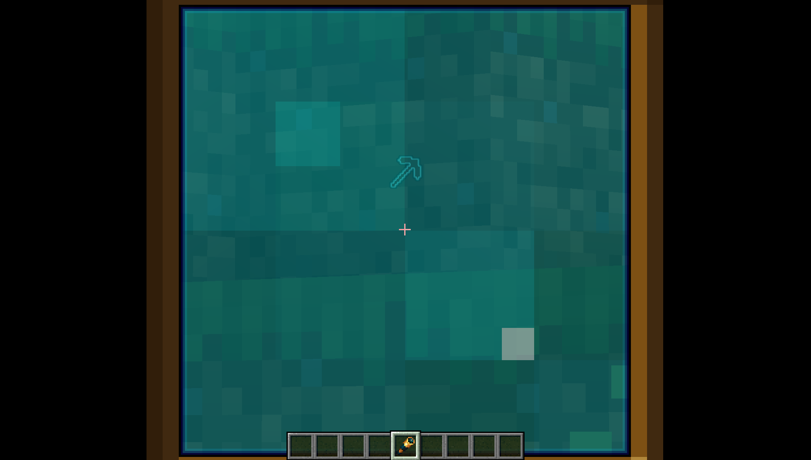

# Reclamation

This mod adds a spectral spyglass which will make items dropped from any entity's death glow when looking through it, including the player's.

The spectral spyglass is crafted with four echo shards, like so:

Similarly, the recipe of the recovery compass has been made less expensive, now only requiring four echo shards:

## Showcase

Items dropped from an entity's death will glow when looking through the spectral spyglass:

The glow will appear through blocks:

